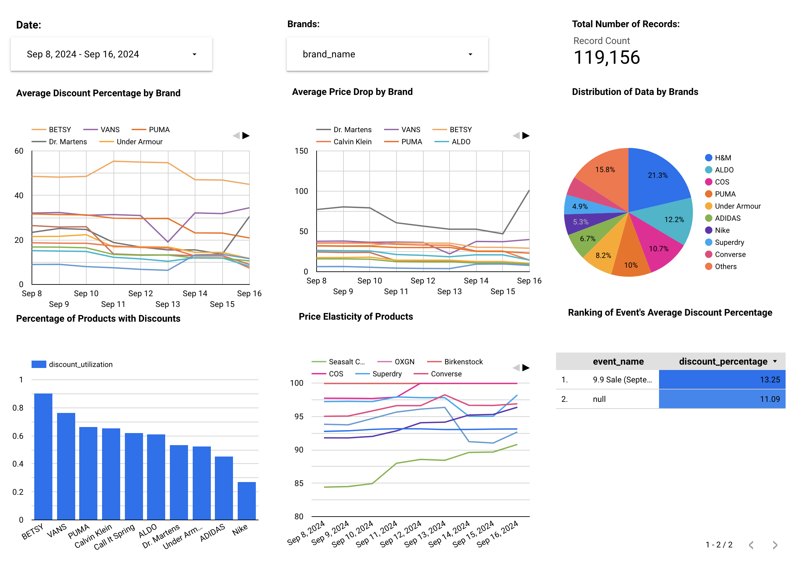

# Insights & Analysis on E-Commerce Sales

## Problem Statement
The rise of E-commerce in Singapore had led to an explosion of various online shopping platforms, each offering an array of sales and promotions.
Initially, special occasion sales like Black Friday, Cyber Monday, etc. dominated the E-commerce landscape.
However, the market has since evolved significantly, with a proliferation of frequent sales event such as 11.11, 12.12, mid and end-of-month sales.
This frequent and diverse array of sales events has made it difficult for consumers to determine the optimal time to make a purchase. 

## Objective
To address this challenge, this project focuses on analyzing product details from Zalora, a leading E-commerce platform in Singapore. This project aims to provide insights and analysis on product pricing trends, enabling consumers to navigate the crowded sales calendar and identify best times to purchase products based on historical data and sales patterns.

## Architecture Diagram

  

## Technologies
- Data processing & transformation: Pandas, dbt
- Storage: Google Cloud Storage Bucket, Google BigQuery
- Infrastructure as Code: Terraform
- Orchestration: Mage
- Others: Docker

## Dashboard
### This is a preliminary snippet of the final dashboard containing 1 week worth of data. More data are expected to arrive as the pipeline runs.

  

### Metrics
- Metric 1: Average discount percentage applied across all products by brands
  - This metric helps in identifying the general fluctuation of discounts applied on different days, highlighting differences between sales events and normal days.
- Metric 2: Average price drop by brands
  - This metric allow us to understand how much, on average, the price drops during sales or promotion group by brands.
- Metric 3: Percentage of products sold with a discount
  - This metric measures the frequency of discounts being applied to products based on their SKU.
- Metric 4: Price elasticity analysis
  - This metric shows how sensitive the pricing is to discounts and how much value consumers are getting compared to their original prices. It gives a macro level of the understanding of the overall pricing strategy used during sales events.
- Metric 5: Ranking of events with biggest discounts
  - This metric ranks the average discount appplied to different brands based on different popular shopping events.

## Acknowledgement
- Zalora Webscraper: ianchute
